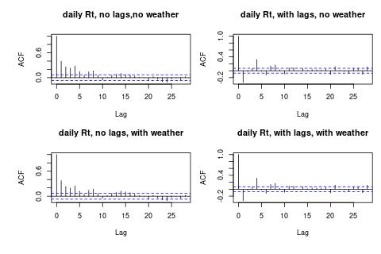
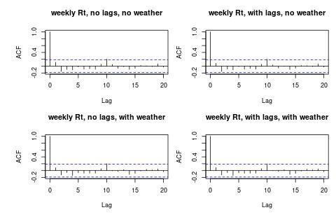

```{r setup, include=FALSE}
knitr::opts_chunk$set(echo = TRUE,
                      warning = FALSE)
```

## Introduction

This document contains the code for the analyses in the publication "Seasonal variation in SARS-CoV-2 transmission in the Netherlands, 2020-2022: statistical evidence for a negative association with temperature." by Klinkenberg et al. (https://doi.org/10.1101/2024.11.28.24318154)

## Loading and processing the data

```{r initialisatie, include=FALSE}
library(tidyverse)
library(lubridate) # manipulating dates
library(mgcv) # generalized additive models, with splines for temp and ah
library(MASS) # sampling from multivariate-normal distributions
library(cowplot) # multipanel plots
library(zoo) # moving averages
library(knitr) # format report

source("./R/Read_data.R")
source("./R/Read_functions.R")
```

Data that is read and processed:

-   population size 2019.
-   logRt and variance per day (file dated April 4, 2022). The inverse (1/variance) is included as a weight in the regression. Both of these are set back in time five days, to go from the Rt on the day of symptom onset to the Rt on the day of infection, an average incubation period back.
-   cumulative incidence per day, estimated from hospital admissions (file dated July 3, 2021). To calculate the offset log(proportion_susceptible).
-   relative transmissibility based on variants per day, estimated from genomic surveillance (file dated October 5, 2021), to calculate the offset log(relativeRt_variants).
-   vaccine uptake per week, age and dose (file dated July 10, 2023). To calculate the offset log(proportion_susceptible). For this purpose, the age-independent vaccination rate of the completed primary series is used, and this is multiplied by 0.75 due to the estimated VE against Delta (<https://www.sciencedirect.com/science/article/pii/S1201971223005349>).
-   intervention periods: 41 periods between January 1, 2020 and April 1, 2023. After March 2020, there were four periods longer than a month: March 28 2020-May 10 2020; June 1 2020-July 5 2020; July 5 2020-Aug 30 2020; February 28 2021-Apr 18 2021.
-   KNMI data (file dated July 11, 2023) containing daily average temperature and relative (!) humidity per day in De Bilt, from January 1, 2000. These are used to calculate the absolute humidity. With this data, five alternative (temp,ah) time series were created, by taking the data from four years earlier, eight years earlier, etc. (so that the leap day is correct). The years 2000-2019 were used for the multi-year average.
-   Google mobility reports (files from 2020, 2021, 2022), containing a daily (relative) score in six categories: work, grocery, residential, transit, retail, and parks.
-   NVP data (file dated September 15, 2023), containing a daily (relative score) in five categories from March 2, 2020: people staying at home, short walk, supermarket, office, care.

All these data are combined into a complete dataset 'alldata_daily'. A complete dataset 'alldata_weekly' is also created from this, in which a running average over 7 days is made of all climate and Google data, and to which the NVP data is added. The final datasets run from February 22, 2020 to March 29, 2023.

```{r Figure_1, echo = FALSE, fig.height=8}
Fridaydata <- alldata_weekly_splitJanssen %>%
   filter(dayinweek == "Friday")

p1 <- Fridaydata %>%
  mutate(Rt = exp(logRt),
         sd = sqrt(1/weight),
         ymin = exp(logRt - 1.96*sd),
         ymax = exp(logRt + 1.96*sd)) %>%
  ggplot(aes(x = date, y = Rt, ymin = ymin, ymax = ymax)) +
  geom_point() +
  geom_linerange() +
  theme_light() +
  scale_y_continuous(limits = c(0, 3)) +
  labs(x = element_blank(), y = expression(italic(R[t])~textstyle("(95% CI)")))  +
  theme(axis.title.y = element_text(vjust = .4))
p2 <- Fridaydata %>%
  dplyr::select(date, temp, temp_avg, temp_reference) %>%
  pivot_longer(temp:temp_avg, names_to = "whichtemp", values_to = "temp") %>%
  mutate(temp = temp + temp_reference) %>%
  mutate(whichtemp = if_else(whichtemp == "temp", "Pandemic years", "Mean 2000-2019")) %>%
  rename(`Weather data` = whichtemp) %>%
  ggplot(aes(x = date, y = temp, color = `Weather data`, alpha = `Weather data`)) +
  geom_point() +
  theme_light() +
  scale_color_manual(values = c("black", "red"), limits = c("Pandemic years", "Mean 2000-2019")) +
  scale_alpha_manual(values = c(1, 0.5), limits = c("Pandemic years", "Mean 2000-2019")) +
  labs(x = element_blank(), y = expression(textstyle("Mean weekly\ntemperature (")*degree*textstyle("C)"))) +
  theme(legend.position = "inside",
        legend.position.inside = c(.17, .15), 
        legend.title = element_blank(), legend.text = element_text(size = 8), legend.key.spacing.y = unit(-0.3, "lines"),
        legend.background = element_rect(fill = NA), legend.key = element_rect(fill = NA),
        axis.title.y = element_text(vjust = -.6))
p3 <- Fridaydata %>%
  dplyr::select(date, ah, ah_avg, ah_reference) %>%
  pivot_longer(ah:ah_avg, names_to = "whichah", values_to = "ah") %>%
  mutate(ah = ah + ah_reference) %>%
  mutate(whichah = if_else(whichah == "ah", "Pandemic years", "Mean 2000-2019")) %>%
  rename(`Weather data` = whichah) %>%
  ggplot(aes(x = date, y = ah, color = `Weather data`, alpha = `Weather data`)) +
  geom_point() +
  theme_light() +
  scale_color_manual(values = c("black", "red"), limits = c("Pandemic years", "Mean 2000-2019")) +
  scale_alpha_manual(values = c(1, 0.5), limits = c("Pandemic years", "Mean 2000-2019")) +
  labs(x = element_blank(), y = expression(textstyle("Mean weekly\nabsolute humidity (g/")*{m}^3*textstyle(")"))) +
  theme(axis.title.y = element_text(vjust = -.6)) +
  guides(color = "none", alpha = "none")
p4 <- Fridaydata %>%
  dplyr::select(date, logRvariant, logUnprotected) %>%
  mutate(Total = logRvariant + logUnprotected) %>%
  rename(Variants = logRvariant,
         Susceptibility = logUnprotected) %>%
  pivot_longer(Variants:Total, names_to = "Contribution", values_to = "offset") %>%
  ggplot(aes(x = date, y = offset, color = Contribution)) +
  geom_point() +
  theme_light() +
  scale_color_manual(values = c("red", "blue", "black"), limits = c("Variants", "Susceptibility", "Total")) +
  labs(x = element_blank(), y = expression(textstyle("Offset (log")*{italic(R[t])}~textstyle(")")), color = "Offset contribution") +
  theme(legend.position = "inside",
        legend.position.inside = c(.18, .21), 
        legend.title = element_text(size = 10), legend.text = element_text(size = 8), legend.key.spacing.y = unit(-0.3, "lines"),
        legend.background = element_rect(fill = NA), legend.key = element_rect(fill = NA),
        axis.title.y = element_text(vjust = .4)) +
  guides(color = guide_legend(title.vjust = -1))
p5 <- Fridaydata %>%
  dplyr::select(date, retail:residential) %>%
  rename(home = residential) %>%
  pivot_longer(retail:home, names_to = "location", values_to = "googleindex") %>%
  # mutate(googleindex = googleindex - googleindex[1], .by = location) %>%
  ggplot(aes(x = date, y = googleindex, color = location)) +
  geom_point() +
  facet_wrap(~location, ncol = 1, scale = "free_y") +
  labs(x = "Date", y = "Normalised Google\nMobility Index") +
  theme_light() +
  theme(
    strip.background = element_blank(),
    strip.text.x = element_blank()
  ) +
  theme(legend.position = "bottom",
            legend.key.spacing.y = unit(-0.3, "lines"), legend.box.margin = margin(t=-10),
        axis.title.y = element_text(vjust = -.6)) +
  guides(color = guide_legend(nrow = 2))
p6 <- Fridaydata %>%
  dplyr::select(date, index_thuisblijvers:index_zorg) %>%
  pivot_longer(index_thuisblijvers:index_zorg, names_to = "location", values_to = "NVPindex") %>%
  mutate(location = case_when(
    location == "index_thuisblijvers" ~ "home",
    location == "index_rondje" ~ "short_walk",
    location == "index_supermarkt" ~ "supermarket",
    location == "index_kantoor" ~ "office",
    TRUE ~ "healthcare"
  )) %>%
  ggplot(aes(x = date, y = NVPindex, color = location)) +
  geom_point() +
  facet_wrap(~location, ncol = 1, scale = "free_y") +
  labs(x = "Date", y = "NVP Mobility Index", color = element_blank()) +
  theme_light() +
  theme(
    strip.background = element_blank(),
    strip.text.x = element_blank(),
    legend.key.spacing.y = unit(-0.3, "lines"),
        axis.title.y = element_text(vjust = .4)
  ) +
  theme(legend.position = "bottom", legend.box.margin = margin(t=-10,l=-10)) +
  guides(color = guide_legend(nrow = 2))
ptitle <- ggdraw() + draw_label("Time series data", fontface='bold') 
plot_grid(
  ptitle, plot_grid(p1, p4, p2, p3, p5, p6, nrow = 3, labels = c("A)", "B)", "C)", "D)", "E)", "F)"), label_size = 12, rel_heights = c(1,1,1.5), align = "v"), ncol = 1, rel_heights=c(0.03, 1))
ggsave("Manuscript/OutputR/Figure_data.jpg", width = 200, height = 200, units = "mm", dpi = 300, bg = "white")
ggsave("Manuscript/OutputR/Figure_data.pdf", width = 200, height = 200, units = "mm", dpi = 300, bg = "white")

```

## Autocorrelation and influence (results in supplement)

We start by looking at autocorrelation, in analyses with daily data and weekly data, and influence of individual datapoints in analyses with weekly data. We perform a total of eight regression analyses with the model

log(Rt) \~ offsets + period [+ dayinweek] [+ delayed logRt] [+ temp + ah]

The eight analyses vary by

-   daily data (with variable dayinweek) or weekly data (from Fridays).
-   with or without delay terms: logR(t-1) + logR(t-2) + ... + logR(t-7) for daily, and logR(t-1) for weekly.
-   with or without temperature and humidity.

The daily analyses also contain the variable dayinweek. The weekly analyses are done with Friday data as default, because these are estimated on Wednesdays when the least disruptions in reports are expected due to weekend effects.

```{r autocorrelatie, echo=FALSE}
source("./R/Analysis_1_autocorrelation.R")
```

```{r plot_autocorrelation, echo=FALSE}
write_csv(regressionsummaries_1 %>%
            dplyr::select(-AIC), 
          file = "Manuscript/OutputR/Table_autocorrelation.csv")
knitr::kable(regressionsummaries_1 %>%
            dplyr::select(-AIC), caption = "autocorrelation tests")

jpeg(file = "Manuscript/OutputR/Figure_autocorrelation_daily.jpg", width = 480, height = 320)
par(mfrow = c(2, 2))
par(cex = 0.75)
par(mar = c(5, 5, 3, 0), oma = c(1, 1, 1, 1))
acf(regressionobjects_1[[5]]$residuals, main = "daily Rt, no lags,no weather")
acf(regressionobjects_1[[7]]$residuals, main = "daily Rt, with lags, no weather")
acf(regressionobjects_1[[6]]$residuals, main = "daily Rt, no lags, with weather")
acf(regressionobjects_1[[8]]$residuals, main = "daily Rt, with lags, with weather")
invisible(dev.off())

jpeg(file = "Manuscript/OutputR/Figure_autocorrelation_weekly.jpg", width = 480, height = 320)
par(mfrow = c(2, 2))
par(cex = 0.75)
par(mar = c(5, 5, 3, 0), oma = c(1, 1, 1, 1))
acf(regressionobjects_1[[1]]$residuals, main = "weekly Rt, no lags, no weather")
acf(regressionobjects_1[[3]]$residuals, main = "weekly Rt, with lags, no weather")
acf(regressionobjects_1[[2]]$residuals, main = "weekly Rt, no lags, with weather")
acf(regressionobjects_1[[4]]$residuals, main = "weekly Rt, with lags, with weather")
invisible(dev.off())




cooksplotdata %>%
  mutate(panelname = 
           c("separate one-week periods, no weather",
             "separate one-week periods, with weather",
             "single two-week period, no weather",
             "single two-week period, with weather")[modelid]) %>%
  ggplot(aes(x = date, y = cooksdist)) +
  geom_point() +
  facet_wrap(~panelname) +
  theme_light() +
  labs(x = "Date", y = "Cook's distance", title = "Influence of datapoints on regression results")
ggsave("Manuscript/OutputR/Figure_Cooks.jpg", width = 200, height = 80, units = "mm", dpi = 300)

```

## Main analysis: weather variables

In the main analysis, we look at models in which temperature and humidity are included as linear terms in the model or as splines, both those of the week itself and those of the week before. Furthermore, the model only contains the offset and period as explanatory variables. This gives thirteen different regression analyses:

log(Rt) \~ offsets + period [+ s(temp_t)] [+ s(ah_t)] [+ s(temp_t-1)] [+ s(ah_t-1)]

```{r main_analyses, echo = FALSE}
source("./R/Analysis_2_baselinelinearterms.R")
source("./R/Analysis_3_baselinesplineterms.R")
```

```{r plotRttemp, echo = FALSE, fig.height=3}
relativeRts_2 <- lapply(regressionobjects_2[regressionsummaries_2$offset], summarise_relRt_season)
relativeRts_2 <- sapply(relativeRts_2, function(x) present_interval(t(x), "amplitude", precision = 2))
relativeRts_3 <- lapply(regressionobjects_3[regressionsummaries_3$offset], summarise_relRt_season)
relativeRts_3 <- sapply(relativeRts_3, function(x) present_interval(t(x), "amplitude", precision = 2))

outputtable_mainlin <- regressionsummaries_2 %>%
            filter(offset) %>%
               dplyr::select(-modelid, -offset, -temp_1, -ah_1, -AIC) %>%
               rename(`Delay terms` = Xdelay,
                      Humidity = ah,
                      Temperature = temp,
                      B_temp = temp_0,
                      B_ah = ah_0
                      ) %>%
               mutate(
                 AICc0 = AICc[1],
                 dAICc = AICc - AICc0,
                 AICc = round(AICc, 2),
                 dAICc = round(dAICc, 2),
                 Rsq = round(Rsq, 2),
                 `Rtmax/Rtmin` = relativeRts_2) %>%
               arrange(AICc) %>%
  dplyr::select(-B_ah, -B_temp, -AICc, -BIC, -AICc0)

outputtable_mainspl <- regressionsummaries_3 %>%
            filter(offset) %>%
               dplyr::select(-modelid, -offset, -AIC) %>%
               rename(`Delay terms` = Xdelay,
                      Humidity = ah,
                      Temperature = temp,
                      Npar_temp = temp_0,
                      Npar_ah = ah_0,
                      Npar_temp_1 = temp_1,
                      Npar_ah_1 = ah_1
                      ) %>%
                mutate(
                 AICc0 = AICc[1],
                 dAICc = AICc - AICc0,
                 AICc = round(AICc, 2),
                 dAICc = round(dAICc, 2),
                 Rsq = round(Rsq, 2),
                 `Rtmax/Rtmin` = relativeRts_3) %>%
               arrange(AICc) %>%
  dplyr::select(-Npar_ah, -Npar_temp, -Npar_ah_1, -Npar_temp_1, -npar, -AICc, -BIC, -AICc0)

write_csv(outputtable_mainlin, 
          file = "Manuscript/OutputR/table_mainresults_linear.csv")
write_csv(outputtable_mainspl, 
          file = "Manuscript/OutputR/table_mainresults_spline.csv")

knitr::kable(outputtable_mainlin, caption = "Main analysis, linear models")
knitr::kable(outputtable_mainspl, caption = "Main analysis, spline models")

p1 <- plot_relRt_season(regressionobjects_2[[6]], alldata_weekly %>%
                    filter(year(date) == "2021") %>%
                    mutate(temp = seq(-5, 31.4, .1) - temp_reference) %>%
                    mutate(date = seq(-5, 31.4, .1)),
                  newdata = TRUE, 
                  # plottitle = "Relation between reproduction number and temperature", 
                  plottitle = NULL,
                  xtitle = "Temperature (degrees Celsius)") +
  labs(y = expression(textstyle(textstyle("Relative ")~italic(R[t]))))
p2 <- plot_relRt_season(regressionobjects_2[[6]], alldata_weekly %>%
                    mutate(temp = temp_avg) %>%
                    filter(year(date) == "2021") %>%
                    mutate(date = 1:365),
                  newdata = TRUE, 
                  # plottitle = "Average seasonality in reproduction number due to temperature",
                   plottitle = NULL,
                 xtitle = "Day in year") +
  scale_x_continuous(labels = c("Jan", "Apr", "Jul", "Oct", "Jan"),
                   breaks = c(1, 91, 182, 274, 365)) +
  scale_y_continuous(limits = c(0,1.4)) +
  labs(y = expression(textstyle(textstyle("Relative ")~italic(R[t]))))
ptitle <- ggdraw() + draw_label("Reproduction number relative to annual mean", fontface='bold') 
plot_grid(
  ptitle, plot_grid(p1, p2, nrow = 1, labels = c("A)", "B)"), label_size = 12), ncol = 1, rel_heights=c(0.1, 1))
ggsave("Manuscript/OutputR/Figure_mainresults_Rttemperaturelinear.jpg", width = 200, height = 80, units = "mm", dpi = 300, bg = "white")
ggsave("Manuscript/OutputR/Figure_mainresults_Rttemperaturelinear.pdf", width = 200, height = 80, units = "mm", dpi = 300, bg = "white")

```

```{r plotRtperiod, echo = FALSE, fig.height=8}

plot_Rtpred(regressionobjects_2[[6]], Fridaydata,  
            plottitle = "Predicted reproduction number with only period effects",
            with_period = TRUE, with_season = FALSE, with_offset = FALSE, plotobserved = FALSE, 
            coloroutliers = FALSE, yrange = c(-0.2,4)) +
 scale_color_gradientn(colours = c("white", "yellow", "orange", "red", "black")) +
  geom_line(mapping = aes(x = date, y = OSIlevel, color = OSI), data = OxfordIndex %>% mutate(OSIlevel = -0.15), linewidth = 5) +
   theme(legend.position = "inside",
        legend.position.inside = c(.93,.2), legend.title = element_blank(), legend.key.size = unit(.4, 'cm'), legend.background = element_rect(fill = NA)) +
  annotate(geom = "text", x = ymd("2021-10-01"), y = 0.10, label = "Oxford Stringency Index")

ggsave("Manuscript/OutputR/Figure_mainresults_Rtepidemicperiod.jpg", width = 200, height = 130, units = "mm", dpi = 300, bg = "white")
ggsave("Manuscript/OutputR/Figure_mainresults_Rtepidemicperiod.pdf", width = 200, height = 130, units = "mm", dpi = 300, bg = "white")

```

```{r plotRttemperature, echo = FALSE, fig.height=8}

p1 <- plot_Rtpred(regressionobjects_2[[1]], Fridaydata,
            plottitle = "Model without temperature",
            with_period = TRUE, with_season = FALSE, with_offset = TRUE, plotobserved = FALSE, 
            coloroutliers = FALSE, yrange = c(0,3.5)) +
    geom_point(aes(y = actual), shape = 18, size = 3, color = "red") +
  labs(x = NULL)
p2 <- plot_Rtpred(regressionobjects_2[[6]], Fridaydata,  
            plottitle = "Selected model (with temperature)",
            with_period = TRUE, with_season = TRUE, with_offset = TRUE, plotobserved = FALSE, 
            coloroutliers = FALSE, yrange = c(0,3.5)) +
  geom_point(aes(y = actual), shape = 18, size = 3, color = "red") +
  annotate(geom = "point", shape = 18, size = 3, color = "red", x = ymd("2021-12-01"), y = 0.2) +
  annotate(geom = "text", label = "Observations", x = ymd("2022-02-01"), y = 0.2)

ptitle <- ggdraw() + draw_label(expression(textstyle("Effect of including temperature on the prediction of ")~italic(R[t])), fontface='bold') 
plot_grid(
  ptitle, plot_grid(p1, p2, nrow = 2, rel_heights = c(4,4), labels = c("A)", "B)"), label_size = 12), rel_heights=c(0.05, 1), ncol = 1)
ggsave("Manuscript/OutputR/Figure_mainresults_Rtepidemictemperature.jpg", width = 200, height = 200, units = "mm", dpi = 300, bg = "white")
ggsave("Manuscript/OutputR/Figure_mainresults_Rtepidemictemperature.pdf", width = 200, height = 200, units = "mm", dpi = 300, bg = "white")

```


## Additional analysis: alternative temperature and humidity time series

These analyses were meant to see if the relation with temperature is due to the confounder day-of-year, potentially giving rise to a correlation between two independent seasonally varying variables.

```{r sensitivityahtemp, echo = FALSE}
source("./R/Analysis_4_sensitivity_ahtempdata.R")

outputtable_tempah <- regressionsummaries_4 %>%
               dplyr::select(-modelid, -temp_0, -ah_0, -AIC) %>%
               rename(Humidity = ah,
                      Temperature = temp,
                      ) %>%
               mutate(
                 ahtemp = case_when(ahtemp == "_avg" ~ "average",
                            ahtemp == "_04" ~ "2016-2018",
                            ahtemp == "_08" ~ "2012-2014",
                            ahtemp == "_12" ~ "2008-2010",
                            ahtemp == "_16" ~ "2004-2006",
                            ahtemp == "_20" ~ "2000-2002",
                            TRUE ~ "2020-2022"
                            ),
                 AICc0 = AICc[1],
                 dAICc = AICc - AICc0,
                 AICc = round(AICc, 2),
                 dAICc = round(dAICc, 2)) %>%
  dplyr::filter(Humidity | Temperature) %>%
  mutate(Weather = case_when(Humidity & Temperature ~ "T and ah",
                             Humidity ~ "only T",
                             TRUE ~ "only ah")) %>%
  dplyr::select(-Humidity, -Temperature, -AICc, -BIC, -AICc0) %>%
  rename(Years = ahtemp) %>%
  pivot_wider(names_from = Weather, values_from = dAICc)

write_csv(outputtable_tempah, 
          file = "Manuscript/OutputR/table_sensitivityahtemp.csv")
knitr::kable(outputtable_tempah, caption = "dAICc weather time series")
```

## Additional analyses: Google mobility en Netherlands Translocation Panel (NVP)

These analyses were meant to see if the relation is mediated by mobility as measured by Google and by NVP. None of the NVP models explained the data better than the selected model of the main analysis.

```{r sensitivitygoogle, echo=FALSE}
source("./R/Analysis_5_sensitivitylinear_google.R")

regsum5subset <- regressionsummaries_5 %>%
  rename(`Delay terms` = Xdelay) %>%
  dplyr::filter(climate != "+ temp + ah") %>%
  mutate(         
    AICc0 = AICc[1],
    dAICc = AICc - AICc0,
    AICc = round(AICc, 2),
    dAICc = round(dAICc, 2),
    Rsq = round(Rsq, 2)) %>%
  arrange(AICc) %>%
  filter(dAICc <= -19.1) %>%# | (!retail & !grocery & !parks & !transit & !work & !residential & !`Delay terms`)) %>%
  rename(season = climate) %>%
  dplyr::select(-season, -AIC, -AICc, -BIC, -npar, -nsample, -AkaikeWeight, -AICc0)

relativeRts_5 <- lapply(regressionobjects_5[regsum5subset$modelid], summarise_relRt_season)
relativeRts_5 <- sapply(relativeRts_5, function(x) present_interval(t(x), "amplitude", precision = 1))

outputtable_google <- regsum5subset %>%
               dplyr::select(-modelid) %>%
               mutate(
                 `Rtmax/Rtmin` = relativeRts_5)

write_csv(outputtable_google, 
          file = "Manuscript/OutputR/Table_sensitivitygoogle.csv")

knitr::kable(outputtable_google, caption = "Sensitivity Google mobility")
```

```{r sensitivityNVP, echo=FALSE}
source("./R/Analysis_6_sensitivitylinear_NVP.R")

regsum6subset <- regressionsummaries_6 %>%
  rename(`Delay terms` = Xdelay) %>%
  dplyr::filter(climate != "+ temp + ah") %>%
  mutate(         
    AICc0 = AICc[1],
    dAICc = AICc - AICc0,
    AICc = round(AICc, 2),
    dAICc = round(dAICc, 2),
    Rsq = round(Rsq)) %>%
  arrange(AICc) %>%
  filter(AICc <= AICc[20] | (!thuis & !rondje & !supermarkt & !kantoor & !zorg & !`Delay terms`)) %>%
  rename(season = climate)

relativeRts_6 <- lapply(regressionobjects_6[regsum6subset$modelid], summarise_relRt_season)
relativeRts_6 <- sapply(relativeRts_6, function(x) present_interval(t(x), "amplitude", precision = 1))

write_csv(regsum6subset %>%
               dplyr::select(-modelid, -nsample) %>%
               mutate(
                 `Rtmax/Rtmin` = relativeRts_6), 
          file = "Manuscript/OutputR/table_sensitivityNVP.csv")

```

## Sensitivity analyses

### Treating the two-week period 26 June 2021 - 9 July 2021 as one period

This is around "Dansen met Janssen", when nightlife was opened for a brief period of time, leading to an explosion of new cases.

```{r baselineJanssen, echo=FALSE}
source("./R/Analysis_7_baselinelineartermsJanssen.R")
source("./R/Analysis_8_baselinesplinetermsJanssen.R")
```

```{r plotbaselinearJanssen, echo = FALSE, fig.height=4}
relativeRts_7 <- lapply(regressionobjects_7, summarise_relRt_season)
relativeRts_7 <- sapply(relativeRts_7, function(x) present_interval(t(x), "amplitude", precision = 1))
relativeRts_8 <- lapply(regressionobjects_8, summarise_relRt_season)
relativeRts_8 <- sapply(relativeRts_8, function(x) present_interval(t(x), "amplitude", precision = 1))

outputtable_Janlin <- regressionsummaries_7 %>%
               dplyr::select(-modelid, -temp_1, -ah_1, -AIC) %>%
               rename(`Delay terms` = Xdelay,
                      Humidity = ah,
                      Temperature = temp,
                      B_temp = temp_0,
                      B_ah = ah_0
                      ) %>%
               mutate(
                 AICc0 = AICc[1],
                 dAICc = AICc - AICc0,
                 AICc = round(AICc, 2),
                 dAICc = round(dAICc, 2),
                 `Rtmax/Rtmin` = relativeRts_7) %>%
               arrange(AICc) %>%
  dplyr::select(-B_ah, -B_temp, -AICc, -BIC, -AICc0)

outputtable_Janspl <- regressionsummaries_8 %>%
               dplyr::select(-modelid, -AIC) %>%
              rename(`Delay terms` = Xdelay,
                      Humidity = ah,
                      Temperature = temp,
                      Npar_temp = temp_0,
                      Npar_ah = ah_0,
                      Npar_temp_1 = temp_1,
                      Npar_ah_1 = ah_1
                      ) %>%
                mutate(
                 AICc0 = AICc[1],
                 dAICc = AICc - AICc0,
                 AICc = round(AICc, 2),
                 dAICc = round(dAICc, 2),
                 `Rtmax/Rtmin` = relativeRts_8) %>%
               arrange(AICc) %>%
  dplyr::select(-Npar_ah, -Npar_temp, -Npar_ah_1, -Npar_temp_1, -AICc, -BIC, -AICc0)

write_csv(outputtable_Janlin, 
          file = "Manuscript/OutputR/Table_results_sensJanssen_linear.csv")

write_csv(outputtable_Janspl, 
          file = "Manuscript/OutputR/table_results_sensJanssen_spline.csv")

knitr::kable(outputtable_Janlin, caption = "Single two-week period, linear models")
knitr::kable(outputtable_Janspl, caption = "Single two-week period, spline models")
```

### Day of week

Using logRt of all days-of-week one by one, instead of Friday as in the main analysis.

```{r baselinedayofweek, echo=FALSE}
source("./R/Analysis_9_dayofweeklinearterms.R")
source("./R/Analysis_10_dayofweeksplineterms.R")
```

```{r dayofweekoutputtable, echo = FALSE, fig.height=4}

regressionsummaries_9 <- regressionsummaries_9 %>%
  mutate(AkaikeWeight = exp(-AICc/2)/sum(exp(-AICc/2)),
         dAICc = AICc - AICc[1], .by = day) 
regressionsummaries_10 <- regressionsummaries_10 %>%
  mutate(AkaikeWeight = exp(-AICc/2)/sum(exp(-AICc/2)),
         dAICc = AICc - AICc[1], .by = day) 

outputtable_AIClin <- regressionsummaries_9 %>%
  filter(!Xdelay | ah | temp) %>%
  dplyr::select(temp, ah, Xdelay, day, dAICc) %>%
    mutate(dAICc = round(dAICc, 2)) %>%
  arrange(Xdelay, ah, temp) %>%
  pivot_wider(names_from = day, values_from = dAICc)

outputtable_AICspl <- regressionsummaries_10 %>%
  filter(!Xdelay | ah | temp) %>%
  dplyr::select(temp, ah, Xdelay, day, dAICc) %>%
    mutate(dAICc = round(dAICc, 2)) %>%
  arrange(Xdelay, ah, temp) %>%
  pivot_wider(names_from = day, values_from = dAICc)

outputtable_Rtlin <- regressionsummaries_9 %>%
  filter(!Xdelay | ah | temp) %>%
  dplyr::select(temp, ah, Xdelay, day, relRt) %>%
  arrange(Xdelay, ah, temp) %>%
  pivot_wider(names_from = day, values_from = relRt)

outputtable_Rtspl <- regressionsummaries_10 %>%
  filter(!Xdelay | ah | temp) %>%
  dplyr::select(temp, ah, Xdelay, day, relRt) %>%
  arrange(Xdelay, ah, temp) %>%
  pivot_wider(names_from = day, values_from = relRt)

write_csv(outputtable_AIClin, 
          file = "Manuscript/OutputR/Table_results_sensdayofweekdAICc_linear.csv")

write_csv(outputtable_AICspl, 
          file = "Manuscript/OutputR/Table_results_sensdayofweekdAICc_spline.csv")

write_csv(outputtable_Rtlin, 
          file = "Manuscript/OutputR/Table_results_sensdayofweekrelRt_linear.csv")

write_csv(outputtable_Rtspl, 
          file = "Manuscript/OutputR/Table_results_sensdayofweekrelRt_spline.csv")

knitr::kable(outputtable_AIClin, caption = "dAICc, day of week, linear models")
knitr::kable(outputtable_AICspl, caption = "dAICc, day of week, spline models")
knitr::kable(outputtable_Rtlin, caption = "Rtmax/Rtmin, day of week, linear models")
knitr::kable(outputtable_Rtspl, caption = "Rtmax/Rtmin, day of week, spline models")
```

### Offset

Not including an offset in the analyses (models have already been run).

```{r plotRttemp_nooffset, echo = FALSE, fig.height=4}
relativeRts_2 <- lapply(regressionobjects_2[!regressionsummaries_2$offset], summarise_relRt_season)
relativeRts_2 <- sapply(relativeRts_2, function(x) present_interval(t(x), "amplitude", precision = 1))
relativeRts_3 <- lapply(regressionobjects_3[!regressionsummaries_3$offset], summarise_relRt_season)
relativeRts_3 <- sapply(relativeRts_3, function(x) present_interval(t(x), "amplitude", precision = 1))

outputtable_noofflin <- regressionsummaries_2 %>%
            filter(!offset) %>%
               dplyr::select(-modelid, -offset, -temp_1, -ah_1, -AIC) %>%
               rename(`Delay terms` = Xdelay,
                      Humidity = ah,
                      Temperature = temp,
                      B_temp = temp_0,
                      B_ah = ah_0
                      ) %>%
               mutate(
                 AICc0 = AICc[1],
                 dAICc = AICc - AICc0,
                 AICc = round(AICc, 2),
                 dAICc = round(dAICc, 2),
                 Rsq = round(Rsq, 2),
                 `Rtmax/Rtmin` = relativeRts_2) %>%
               arrange(AICc) %>%
  dplyr::select(-B_ah, -B_temp, -AICc, -BIC, -AICc0)

outputtable_nooffspl <- regressionsummaries_3 %>%
            filter(!offset) %>%
               dplyr::select(-modelid, -offset, -AIC) %>%
               rename(`Delay terms` = Xdelay,
                      Humidity = ah,
                      Temperature = temp,
                      Npar_temp = temp_0,
                      Npar_ah = ah_0,
                      Npar_temp_1 = temp_1,
                      Npar_ah_1 = ah_1
                      ) %>%
                mutate(
                 AICc0 = AICc[1],
                 dAICc = AICc - AICc0,
                 AICc = round(AICc, 2),
                 dAICc = round(dAICc, 2),
                 Rsq = round(Rsq, 2),
                 `Rtmax/Rtmin` = relativeRts_3) %>%
               arrange(AICc) %>%
  dplyr::select(-Npar_ah, -Npar_temp,-Npar_ah_1, -Npar_temp_1, -npar, -AICc, -BIC, -AICc0)

write_csv(outputtable_noofflin, 
          file = "Manuscript/OutputR/Table_nooffsetresults_linear.csv")
write_csv(outputtable_nooffspl, 
          file = "Manuscript/OutputR/Table_nooffsetresults_spline.csv")

knitr::kable(outputtable_noofflin, caption = "No offset, linear models")
knitr::kable(outputtable_nooffspl, caption = "No offset, spline models")
```

```{r plotRtepidemic_nooffset, echo = FALSE, fig.height=4}
origplotdata <- plot_Rtpred(regressionobjects_2[[6]], Fridaydata,  
            plottitle = "Only period effects",
            with_period = TRUE, with_season = FALSE, with_offset = FALSE, plotobserved = FALSE, 
            coloroutliers = FALSE, yrange = c(-0.2,5), returndata = TRUE)
origplotdataoffset <- plot_Rtpred(regressionobjects_2[[6]], Fridaydata,  
            plottitle = "Only period effects",
            with_period = TRUE, with_season = FALSE, with_offset = TRUE, plotobserved = FALSE, 
            coloroutliers = FALSE, yrange = c(-0.2,5), returndata = TRUE)
nooffsetplotdata <- plot_Rtpred(regressionobjects_2[[5]], Fridaydata,  
            plottitle = "Only period effects",
            with_period = TRUE, with_season = FALSE, with_offset = FALSE, plotobserved = FALSE, 
            coloroutliers = FALSE, yrange = c(-0.2,5), returndata = TRUE)
allplotdata <- origplotdata %>%
  mutate(Model = "Main analysis: period effect") %>%
  bind_rows(origplotdataoffset %>% 
              mutate(Model = "Main analysis: period effect + offset")) %>%
  bind_rows(nooffsetplotdata %>% 
              mutate(Model = "Analysis without offset: period effect"))
ggplot(aes(x = date, y = est, color = Model, shape = Model), data = allplotdata) + 
      geom_point() +
  geom_point(data = allplotdata %>% filter(Model == "Main analysis: period effect + offset")) +
 scale_color_manual(values = c("red", "black", "black"), 
                     limits = c("Analysis without offset: period effect", 
                                "Main analysis: period effect", 
                                "Main analysis: period effect + offset")) +
 scale_shape_manual(values = c(19, 19, 4), 
                     limits = c("Analysis without offset: period effect", 
                                "Main analysis: period effect", 
                                "Main analysis: period effect + offset")) +
      theme_light() +
    coord_cartesian(ylim = c(-0.2,3.5)) +
    labs(title = "Estimated period effect in relation to the offset",
         x = "Date", y = "Reproduction number") +
   theme(legend.position = "inside",
        legend.position.inside = c(.25,.8))

ggsave("Manuscript/OutputR/Figure_nooffsetresults_offseteffect.jpg", width = 150, height = 120, units = "mm", dpi = 300)

```
